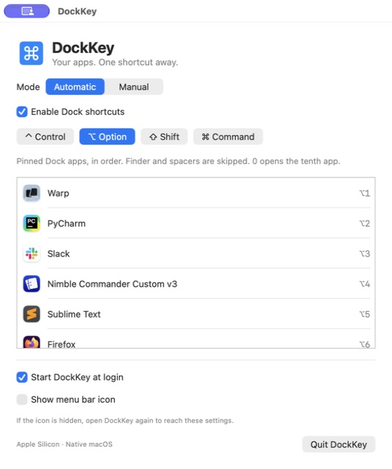

# DockKey

[](https://github.com/9dogs/dock-key/actions/workflows/build.yml)

A small native Apple Silicon macOS app that launches or focuses applications with keyboard shortcuts. Requires macOS 13 or later. Built in Swift using AppKit and SwiftUI; no third-party dependencies.

DockKey takes inspiration from **Snap**, the app that switches between Dock applications using modifier + number shortcuts. DockKey is an independent implementation built natively for **Apple Silicon**.



## Features

- Launch or focus pinned Dock applications with Option+1–9 and Option+0.
- Follow Dock order automatically, skipping Finder and spacers.
- Choose your modifier keys or record custom shortcuts for individual applications.
- Start at login and optionally hide the menu bar icon.

## Install and use

1. Download `DockKey-arm64.zip` from [Releases](https://github.com/9dogs/dock-key/releases), download a build from [Actions](https://github.com/9dogs/dock-key/actions/workflows/build.yml), or build the app using the instructions below. Unzip the download. Quit Snap or any other app using the same shortcuts.
2. Copy the generated `DockKey.app` to Applications (or your personal Applications folder).
3. Open DockKey. Option+1 opens the first pinned Dock app, Option+2 the second, and so on. Option+0 opens the tenth.
4. Choose any combination of Control, Option, Shift and Command in Automatic settings.
5. Optionally enable “Start DockKey at login” after moving the app to its permanent location. macOS may require approval in System Settings → General → Login Items.

Closing the settings window leaves shortcuts active. The menu bar icon opens settings and offers Quit. If you hide the icon, open the application again to show settings.

## Manual shortcuts

Choose Manual → Add Application, select an app, and press a shortcut including Control, Option or Command. Click an existing shortcut to record a replacement; Escape cancels recording. The minus button removes an entry. Manual shortcuts work alongside automatic shortcuts. Registration conflicts appear in the settings window.

## Scope and limitations

- Automatic mode follows the first ten pinned applications in the Dock. Finder, spacers, folders and documents are skipped. Temporary unpinned running apps and the Dock’s recent-apps section are not included.
- Dock order refreshes every two seconds and immediately when a numbered shortcut is used. Dock preferences are a macOS implementation detail, so future macOS changes may require an update to the reader.
- Numbered shortcuts use physical number-row key positions (1–0 on a US layout). Other layouts may show different key legends.
- Global shortcuts use RegisterEventHotKey; the application does not request Accessibility or Input Monitoring access. Shortcuts may be unavailable while macOS Secure Input is active or when reserved by another app/system feature.
- This local build has an ad-hoc code signature. It is not Developer ID signed or notarized for public distribution. No network requests, analytics, or updater are included.
- Login launch uses Apple’s SMAppService: https://developer.apple.com/documentation/servicemanagement/smappservice

## Verification

- Compiles for `arm64-apple-macosx13.0`; executable architecture and code signature checked.
- Tests cover Dock ordering, Finder exclusion, spacers, invalid entries, non-file URLs, percent-encoded paths, duplicate entries, empty Dock and reordered Dock.
- Live Dock output matched the local pinned app order.
- Both settings screens visually inspected. Adding an application, recording Control+Option+T, and removing the temporary manual entry were verified through the UI.
- Global shortcut registration reported no conflicts during the UI check. Foreground activation still requires a manual keyboard check.
- Launch at login has not been tested through a logout/login cycle.

## Build and test

On an Apple Silicon Mac, install Xcode or Apple Command Line Tools, then run:

```sh
git clone https://github.com/9dogs/dock-key.git
cd dock-key
./build.sh
./test.sh
./DockKey.app/Contents/MacOS/DockKey --check-dock
```

`build.sh` creates an Apple Silicon application bundle and signs it locally. The source, tests and build scripts are included so the app can be maintained without an external package service.


## Automatic builds and releases

GitHub Actions builds and tests the app on a macOS runner on every push to `main`, pull request to `main`, and manual workflow run. Each successful run provides a **DockKey-arm64** artifact containing the app ZIP and its SHA-256 checksum; artifacts are retained for 30 days. Download the artifact from the run’s summary while signed in to GitHub, then extract the artifact and app ZIP.

To publish a release, push a version tag:

```sh
git tag v1.0.0
git push origin v1.0.0
```

Tags must use `vMAJOR.MINOR.PATCH`. After tests, compilation, architecture verification and signature validation pass, the workflow publishes a GitHub Release with `DockKey-arm64.zip` and its checksum. The tag sets the app version; the workflow run number sets the build number. Re-running a tag workflow replaces that release’s build assets.

Builds are **ad-hoc signed, not Developer ID signed or notarized**. Downloaded builds may trigger Gatekeeper; building locally is also supported. Developer ID signing and notarization would require an Apple Developer certificate and credentials, which are not configured here.

For a local versioned build, use `APP_VERSION=1.2.3 BUILD_NUMBER=4 ./build.sh`.
